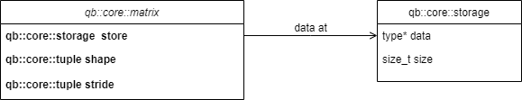

>
# Core Module
This module just deals with general purpose linear algebra and
the central data structure in this module is the `Matrix` class.
The `Matrix` class represents a generic matrix which contains 
elements of a scalar type `T`.<br>
As per the structure of the library, it is split into the 
implementation: `matrix` which is contains a way to access it's 
corresponding `storage` class, which has the data.

<style>
    .baseds{
        filter:invert(1);
    }
</style>

<Br><Br>

# Contents

1. [Storage](#storage)
    - [Code Analysis](#code-analysis)
2. [Matrix](#matrix)
    - [Code Analysis](#code-analysis-1)
    - [Matrix Math](#matrix-maths)


# Storage
This class contains the elements of a matrix and ways to access 
them. The elements are stored in a contiguous array and since 
the matrices are strided, views are provided and the `matrix` 
class accessing them have stride info.<br>
The user may choose to define the sizes of matrix at compile-time
or at runtime. The `matrix` and `storage` datatypes take care of 
all the heavy-lifting there giving this more of a python-like 
feel.

Overall, the point is: `storage` class is just to store the elements
because some cases may arise where two matrices may need to share the
same buffer, like in views and slices. So, the only functionalities we need
from this is storage as arrays and accessing them by index.

## Code analysis

```cpp
template<typename T, int64_t sizeatcompiletime, 
bool is_dynamic=(sizeatcompiletime == Dynamic)>
class storage{
private:
    T * m_data = nullptr;  // will always be allocated @ runtime
    uint64_t m_size = sizeatcompiletime;  // m_size is @ runtime
    uint64_t m_nref = 1;           // no.of references 

    ...
}
```

Notice that this can be a static or a dynamic storage. A **static** storage 
is fixed and not resizable, it is a feature. To know whether it's **static**
or **dynamic** is determined by the `is_dynamic` compile-time evaluated 
template parameter. Both cases have different constructors enabled by some 
**Template Metaprogramming**. Yeah, fancy terms thrown on your face!

### Constructors & Destructors

Notice what this is:

```cpp
class storage{
private:
    ...
public:
// runtime constructor (meaning you have to provide a size, bitch!)
template<typename U = void, 
std::enable_if_t<is_dynamic, U>* = nullptr>
storage(int64_t n)
:m_size(n){
    if(n>0){
        this->m_data = new T[n];
        if(this->m_data==nullptr){
            throw std::bad_alloc();
        }
    }
}
// compile time constructor (size already provided by you)
template<typename U = void, 
std::enable_if_t<!is_dynamic, U>* = nullptr>
storage(){
    this->m_data = new T[this->m_size];
    if(this->m_data == nullptr){
        throw std::bad_alloc();
    }
}

~storage(){
    if(this->m_data!=nullptr)delete[] this->m_data;
    this->m_data = nullptr;
}
...
};
```

So, this stuff enables you to resolve how your class will be structured at 
compile time. Meaning, during compile time, the compiler will decide which 
of these two constructors is a keeper, as simple as that!

### Accessors

Next are some **accessors**, simple stuff:

```cpp
class storage{
private:
    ...
public:
    ...

    template<typename V, 
    typename=std::enable_if_t<std::is_integral_v<V> > >
    T operator[](V i)const{
        if(i < 0) i+=this->m_size;
        if(i<0||i>this->m_size) {
            throw std::runtime_error("Index out of range!");
        }
        return this->m_data[i];
    }
    template<typename V, 
    typename=std::enable_if_t<std::is_integral_v<V> > >
    T& operator[](int64_t i){
        if(i < 0) i+=this->m_size;
        if(i<0||i>this->m_size){
            throw std::runtime_error("Index out of range!");
        }
        return this->m_data[i];
    }

    size_t size()const{
        return this->m_size;
    }
};
```

Gives you access to the elements and the size of your storage.

### Operations

**Resizing**

Next is a feature specific to **dynamic** storages, resizability.

```cpp
class storage{
private:
    ...
public:
    ...

    // enabled only if we operate on dynamic storages!
    template<typename U=void>
    void resize(int64_t N, std::enable_if_t<is_dynamic,U>* = nullptr){
        // deallocate the current data
        if(this->m_data!=nullptr)delete[] this->m_data;

        // reallocate your stuff
        this->m_data = new T[N];
        if(this->m_data==nullptr){
            throw std::bad_alloc();
        }
        this->m_size = N;
        return;
    }
};
```

Since this operates on a dynamic or static decided at compile 
time rule,
that is leveraged to give a way to resize storage if it is 
dynamic.

### Copying

Some other things to consider are the copy constructor and
assignment operator.

```cpp
class storage{
...
public:
...
template<int64_t csize>
storage(const storage<T,csize>& st)
:m_size(st.m_size)
{   
    if constexpr(sizeatcompiletime!=Dynamic){
        if(st.m_size!=sizeatcompiletime){   
        // deals with when st is static and dynamic
        throw std::runtime_error("Size mismatch for both storages!");
        }
    }
    this->m_data= new T[st.m_size];

    // parallel copying
    uint64_t optimal_threads = std::min((uint64_t)omp_get_num_procs(), 
    (m_size) / 10000);
    omp_set_num_threads(std::max(uint64_t(1), optimal_threads));
    
    #pragma omp parallel for
    for(uint64_t i=0;i<this->m_size;i++){
        this->m_data[i] = T(st[i]);
    }
}
...
};
```
Let's divide this into the compile-time check part (`if constexpr(...)`) and 
the copying part using **OpenMP**.

**Size Check**:
- Note that for **Dynamic** Storages, we don't care what they are 
constructed from, the size can be adjusted.
- But in case of **Static** storages, the size of the storage we
are constructing from must match that of ours.

**Copy Operation**
- This part deals with copying the storage `st` to our current one. We use 
openmp for this case.
- The no.of threads is adjusted dynamically since for small storages,
one thread works and as size increases, it is increased.

The copy assignment works the same way. Move semantics are left to 
default.

For copying, another method is to use the `copy()` method, which 
provides an interface to copy the things. C++17 onwards, RVO helps
to create and assign without any copy overhead.

### Friend Classes

```cpp
class storage{
private:
...
public:
...
template<typename U, int64_t r, int64_t c>
friend class matrix;
...
};
```

Now we understand the use of `m_nref` variable. This is alternative to use 
smart pointers. Every matrix class will have it's own storage pointer. But 
while deleting the storage pointer, if two matrices share the same storage
unit, that will cause problems if one of them destroys that. So, either use
`std::shared_ptr<storage>` or use an internal reference counter.

The latter method is used here, and that is exactly why `matrix` happens to
be a forward declared friend class just to be able to modify the storage's 
reference count.


See the usage in `test/la/storage_test.cpp`

# Matrix

This represents a generic matrix class which has a separate 
`storage` associated with it and contains metadata on how to 
interpret the stuff inside that storage.

This is taken from Eigen library, but ours is more typesafe
and stringent on what can or cannot be done with static and
dynamic matrices!

## Code Analysis

### Class attribs

```cpp
template<typename T, int64_t rowsatcompile, int64_t colsatcompile>
class matrix{
private:
/**
 * Things we do for type safety!
 */
    // some things you might wanna have for bookkeeping
    static constexpr bool dynamic_rows = (rowsatcompile == Dynamic);
    static constexpr bool dynamic_cols = (colsatcompile == Dynamic);
    static constexpr bool dynamic_strg = (dynamic_rows||dynamic_cols);

    // what is the storage size, decide at compile time!
    static constexpr int64_t strg = std::conditional_t<
        dynamic_strg,
        std::integral_constant<int64_t, Dynamic>,
        std::integral_constant<int64_t,rowsatcompile*colsatcompile>
    >::value;

    // private attribs
    storage<T,strg>* m_storage = nullptr;         // init to a nullptr
    uint64_t rows = rowsatcompile;                // rows at runtime
    uint64_t cols = colsatcompile;                // cols at runtime
...
};
```

This is the attrib memory layout. 

*Points to be noted*:
- There are some `static constexpr` variables which are used for 
determining the type of storage and which constructor to include
during compile time itself.

- Then we have member variables, which are all set (and modified)
at runtime only

### Constructors

Depending on cases, we have 4 different constructors (this could be much
better written, but for now go with this).

```cpp
class storage{
private:
    ...
public:
    // dynamic rows and cols
    template<typename U=void, 
    bool drows = dynamic_rows, bool dcols = dynamic_cols, 
    std::enable_if_t<drows&&dcols, U>* = nullptr >
    matrix(int m,int n)
    :rows(m),cols(n){
        // every matrix comes with it's own storage
        this->m_storage = new storage<T, Dynamic>(m*n);
        
    }
    // only rows dynamic here!
    template<typename U=void, 
    bool drows = dynamic_rows, bool dcols = dynamic_cols, 
    std::enable_if_t<drows&&!dcols, U>* = nullptr >
    matrix(int m)
    :rows(m){
        // every matrix comes with it's own storage
        this->m_storage = new storage<T, Dynamic>(m*colsatcompile);
    }
    // only cols dynamic here!
    template<typename U=void, 
    bool drows = dynamic_rows, bool dcols = dynamic_cols, 
    std::enable_if_t<!drows&&dcols, U>* = nullptr >
    matrix(int n)
    :cols(n){
        // every matrix comes with it's own storage
        this->m_storage = new storage<T, Dynamic>(rowsatcompile*n);
    }
    // everything static!
    template<typename U=void, 
    bool drows = dynamic_rows, bool dcols = dynamic_cols, 
    std::enable_if_t<!drows&&!dcols, U>* = nullptr >
    matrix(){
        // every matrix comes with it's own storage
        this->m_storage = new storage<T,strg>();
    }
};
```

`std::enable_if_t` allows compiler to decide which constructor to include 
during compilation time itself. This adds some compilation overhead, but
the goal is to get things efficiently during runtime.

### Destructor

Now it is revealed what is the use of `size_t m_nref` member variable 
in the `qb::core::storage` class.

```cpp
~matrix(){
    // understand first thing that the storage of this
    // matrix may be shared with other objects, so think 
    // carefully before you go deleting it!
    if(this->m_storage){
        // more than one thing is referencing the storage, don't delete!
        if(this->m_storage->m_nref > 1){
            this->m_storage->m_nref--;
        }
        // go ahead!
        else{
            delete this->m_storage;
        } 
        this->m_storage=nullptr;
    }
}
```

This is the destruction procedure which is totally runtime based, unlike
construction steps which are determined during compile time.

### Copy Semantics

This library believes in creating deep copies wherever possible and
use shallow copying in minimal cases.

```cpp
class matrix{
private:
    ...
public:
    template<typename U, int64_t r, int64_t c>
    matrix(const matrix<U,r,c>& mat)
    :rows(mat.rows),cols(mat.cols)
    {
        if constexpr(rowsatcompile!=Dynamic||colsatcompile!=Dynamic){
            // if even one of the dims static, make sure it matches
            if(rowsatcompile!=mat.rows||colsatcompile!=mat.cols){
                throw std::runtime_error("Shape mismatch error!");
            }
        }
        this->m_storage= new storage<T,strg>(*mat.m_storage);
    }

    template<typename U, int64_t r, int64_t c>
    matrix<T,rowsatcompile,colsatcompile>& operator=(const matrix<U,r,c>& mat)
    {
        if constexpr(rowsatcompile!=Dynamic||colsatcompile!=Dynamic){
            // if both dims static, make sure shape matches
            if(rowsatcompile!=mat.rows||colsatcompile!=mat.cols){
                throw std::runtime_error("Shape mismatch error!");
            }
        }
        if(this==&mat)return *this;
        if(this->m_storage){
            if(this->m_storage->m_nref>1){
                this->m_storage->m_nref--;
            }
            else{
                delete[] this->m_storage;
            }
        }

        this->m_storage= new storage<T,strg>(*mat.m_storage);
        return *this;
    }
};
```

This is an extension of the logic in the `storage` case. If the matrix
is even partially static, then we have to perform a runtime check. Simple
logic!

The assignment operator clears up storage and assigns a new storage into
which data is copied in parallel by threads, used in the `storage` copy
constructor.

### Accessors

Accessing can be done with 2D indexing using the `()` operator or 1D
indexing using the `[]` operator. The indexing can be done with any
datatype that is integral.

Negative indexing is supported like in python, so enjoy!

```cpp
class matrix{
private:
    ...
public:
    ...
    // usual indexing 2D
    template<typename V, 
    typename=std::enable_if_t<std::is_integral_v<V> > >
    T operator()(V i, V j)const{
        if(i>=this->rows||j>=this->cols){
            throw std::runtime_error("Index out of range!");
        }
        i = (i<0)? i+this->rows: i;
        j = (j<0)? j+this->cols: j;
        if(i<0||j<0){
            throw std::runtime_error("Index out of range!");
        }

        return (*m_storage)[i*this->cols + j];
    }
    template<typename V, 
    typename=std::enable_if_t<std::is_integral_v<V> > >
    T& operator()(V i, V j){
        if(i>=this->rows||j>=this->cols){
            throw std::runtime_error("Index out of range!");
        }
        i = (i<0)? i+this->rows: i;
        j = (j<0)? j+this->cols: j;
        if(i<0||j<0){
            throw std::runtime_error("Index out of range!");
        }

        return (*m_storage)[i*this->cols + j];
    }
    // flat index
    template<typename V, 
    typename=std::enable_if_t<std::is_integral_v<V> > >
    T operator[](V i)const{
        int64_t N = rows*cols;
        if(i>=N){
            throw std::runtime_error("Index out of range!");
        }
        i = (i<0)? i+N: i;
        if(i<0){
            throw std::runtime_error("Index out of range!");
        }
        return (*m_storage)[i];
    }
    template<typename V, 
    typename=std::enable_if_t<std::is_integral_v<V> > >
    T& operator[](V i){
        int64_t N = rows*cols;
        if(i>=N){
            throw std::runtime_error("Index out of range!");
        }
        i = (i<0)? i+N: i;
        if(i<0){
            throw std::runtime_error("Index out of range!");
        }
        return (*m_storage)[i];
    }
};

```

We can access the storage pointer as a `const` pointer, meaning no
changes allowed to the contents. Also, size accessors present!

```cpp
const storage<T,strg>* data()const{
    return this->m_storage;
}

int64_t size()const{
    return this->m_storage->m_size;
}
int64_t nrows()const{
    return this->rows;
}
int64_t ncols()const{
    return this->cols;
}
```

### Fancy Input fetching!

Eigen has a famous comma initialization, which works well for small
matrices. It is achieved by a `commaInit` class:

```cpp
class matrix{
private:
    ...
public:
    ...
    class commaInit{
    private:
        matrix<T,rowsatcompile,colsatcompile>& mat;
        int index = 0;  // tracks position in matrix
    public: 
        commaInit(matrix<T,rowsatcompile,colsatcompile>& m, T val)
        :mat(m){
            mat[0]=val;
            index = 1;
        }
        commaInit& operator,(T value){
            if(index>=mat.size()){
                throw std::runtime_error("Size of comma-initializer list exceeds matrix size!");
            }
            mat[index]=value;
            ++index;
            return *this;
        }
    };
    commaInit operator<<(T value){
        return commaInit(*this,value);
    }
};
```

So, whenever an operation of this sort is encountered: `mat << 1,2,3,4,5...`, then that is divided into two steps:

- `mat.operator<< (1)` which creates a `commaInit` object.
- `commaInitbject.operator,(2)` and this is chained while maintaining
index and assigning matrix object.

This is good for small matrices since parallel assignment 
is not possible here.

### Operations

**Resizing and Reshaping**

```cpp
template<typename U=void, 
bool drows = dynamic_rows, bool dcols = dynamic_cols, 
std::enable_if_t<drows&&dcols,U>* =nullptr>
void reshape(uint64_t r, uint64_t c){
    if(r*c != rows*cols){
        throw std::runtime_error("Size mismatch, cannot reshape!");
    }
    this->rows=r, this->cols=c;
    return;
}

// resize
// when both dim is dynamic
template<typename U=void, 
bool drows=dynamic_rows, bool dcols=dynamic_cols,
std::enable_if_t<drows&&dcols, U>* = nullptr>
void resize(uint64_t r, uint64_t c){
    this->m_storage->resize(r*c);
    this->rows=r, this->cols=c;
}
// when one dim is dynamic
template<typename U=void, bool drows=dynamic_rows,
std::enable_if_t<drows, U>* = nullptr>
void resize(uint64_t r){
    this->m_storage->resize(r*cols);
    this->rows=r;
}
// when one dim is dynamic
template<typename U=void, bool dcols=dynamic_cols,
std::enable_if_t<dcols, U>* = nullptr>
void resize(uint64_t c){
    this->m_storage->resize(rows*c);
    this->cols=c;
}
```

It is pretty clear what is happening. Resize procedure is divided
this way because of how the aliases will be defined later on.

### Aliases

There are so many useful aliases, and to use them, some of the
methods and constructors were written in a weird way, like the
`resize` function's template metaprogramming was done the way
it was to provide syntatic legibility for vectors and all.

The aliases are:
```cpp
// dynamic matrix, usage: matXf m1(5,6);
using matXf = matrix<float, Dynamic, Dynamic>;
using matXd = matrix<double, Dynamic, Dynamic>;
using matXi = matrix<int, Dynamic, Dynamic>;
using matXl = matrix<long, Dynamic, Dynamic>;
using matXll= matrix<int64_t, Dynamic, Dynamic>;
using matXcf= matrix<std::complex<float>, Dynamic,Dynamic>;
using matXcd = matrix<std::complex<double>, Dynamic, Dynamic>;
using matXci = matrix<std::complex<int>, Dynamic, Dynamic>;
using matXcl = matrix<std::complex<long>, Dynamic, Dynamic>;
using matXcll= matrix<std::complex<int64_t>, Dynamic, Dynamic>;

// static matrices, usage: matvd<4,6> m1;
template<uint64_t i, uint64_t j>
using matVf = matrix<float,i,j>;
template<uint64_t i, uint64_t j>
using matVd = matrix<double,i,j>;
template<uint64_t i, uint64_t j>
using matVi = matrix<int,i,j>;
template<uint64_t i, uint64_t j>
using matVl = matrix<long,i,j>;
template<uint64_t i, uint64_t j>
using matVll = matrix<int64_t,i,j>;
template<uint64_t i, uint64_t j>
using matVcf = matrix<std::complex<float>,i,j>;
template<uint64_t i, uint64_t j>
using matVcd = matrix<std::complex<double>,i,j>;
template<uint64_t i, uint64_t j>
using matVci = matrix<std::complex<int>,i,j>;
template<uint64_t i, uint64_t j>
using matVcl = matrix<std::complex<long>,i,j>;
template<uint64_t i, uint64_t j>
using matVcll = matrix<std::complex<int64_t>,i,j>;

// dynamic column vector
using vecXd = matrix<double, Dynamic, 1>;
using vecXf = matrix<float, Dynamic, 1>;
using vecXi = matrix<int, Dynamic, 1>;
using vecXl = matrix<long, Dynamic, 1>;
using vecXll= matrix<int64_t, Dynamic, 1>;
using vecXcf= matrix<std::complex<float>, Dynamic,1>;
using vecXcd = matrix<std::complex<double>, Dynamic, 1>;
using vecXci = matrix<std::complex<int>, Dynamic, 1>;
using vecXcl = matrix<std::complex<long>, Dynamic, 1>;
using vecXcll= matrix<std::complex<int64_t>, Dynamic, 1>;

// fixed size column vector
template<uint64_t i>
using vecVf = matrix<float,i,1>;
template<uint64_t i>
using vecVd = matrix<double,i,1>;
template<uint64_t i>
using vecVi = matrix<int,i,1>;
template<uint64_t i>
using vecVl = matrix<long,i,1>;
template<uint64_t i>
using vecVll = matrix<uint64_t,i,1>;
template<uint64_t i>
using vecVcf = matrix<std::complex<float>,i,1>;
template<uint64_t i>
using vecVcd = matrix<std::complex<double>,i,1>;
template<uint64_t i>
using vecVci = matrix<std::complex<int>,i,1>;
template<uint64_t i>
using vecVcl = matrix<std::complex<long>,i,1>;
template<uint64_t i>
using vecVcll = matrix<std::complex<int64_t>,i,1>;

// dynamic size row vectors
using rvecXd = matrix<double,1,Dynamic>;
using rvecXf = matrix<float, 1,Dynamic>;
using rvecXi = matrix<int, 1,Dynamic>;
using rvecXl = matrix<long, 1,Dynamic>;
using rvecXll= matrix<int64_t, 1,Dynamic>;
using rvecXcf= matrix<std::complex<float>, 1,Dynamic>;
using rvecXcd = matrix<std::complex<double>, 1,Dynamic>;
using rvecXci = matrix<std::complex<int>, 1,Dynamic>;
using rvecXcl = matrix<std::complex<long>, 1,Dynamic>;
using rvecXcll= matrix<std::complex<int64_t>, 1,Dynamic>;

// fixed size row vectors
template<uint64_t i>
using rvecVf = matrix<float,1,i>;
template<uint64_t i>
using rvecVd = matrix<double,1,i>;
template<uint64_t i>
using rvecVi = matrix<int,1,i>;
template<uint64_t i>
using rvecVl = matrix<long,1,i>;
template<uint64_t i>
using rvecVll = matrix<uint64_t,1,i>;
template<uint64_t i>
using rvecVcf = matrix<std::complex<float>,1,i>;
template<uint64_t i>
using rvecVcd = matrix<std::complex<double>,1,i>;
template<uint64_t i>
using rvecVci = matrix<std::complex<int>,1,i>;
template<uint64_t i>
using rvecVcl = matrix<std::complex<long>,1,i>;
template<uint64_t i>
using rvecVcll = matrix<std::complex<int64_t>,1,i>;
```

Eigen uses something similar to this, but that uses some macros and all. 
In this case, templated using have been written to deliver the similar
functionality, but be more general.

## Matrix Maths

This section explores the matrix math implemented.

### Binary Operations (matrix-matrix)

```cpp
// addition
template<typename U,int64_t r,int64_t c, 
typename R = decltype(std::declval<T>()+std::declval<U>())>
matrix<R,Dynamic,Dynamic> operator+(const matrix<U,r,c>& a){
    // size check: keeping it fully runtime only ow
    // the code will be huge and tedious to debug
    if(rows!=a.nrows()||cols!=a.ncols()){
        throw std::runtime_error("Size mismatch! Cannot perform operation");
    }

    // create matrix from *this
    matrix<R,Dynamic,Dynamic> res(rows,cols);

#ifdef _openmp_included
    // parallelized addition
    uint64_t optimal_threads = std::min(
        (uint64_t)omp_get_num_procs(), 
        uint64_t(rows*cols) / 10000
    );
    omp_set_num_threads(std::max(uint64_t(1), optimal_threads));
    #pragma omp parallel for
#endif
    for(size_t i=0;i<a.size();++i){
        res[i]=(*m_storage)[i]+a[i];
    }
    return res; // rvo: c++17
}
// subtraction
template<typename U,int64_t r,int64_t c, 
typename R = decltype(std::declval<T>()-std::declval<U>())>
matrix<R,Dynamic,Dynamic> operator-(const matrix<U,r,c>& a){
    // size check: keeping it fully runtime only ow
    // the code will be huge and tedious to debug
    if(rows!=a.nrows()||cols!=a.ncols()){
        throw std::runtime_error("Size mismatch! Cannot perform operation");
    }

    // create matrix from *this
    matrix<R,Dynamic,Dynamic> res(rows,cols);

#ifdef _openmp_included
    // parallelized addition
    uint64_t optimal_threads = std::min(
        (uint64_t)omp_get_num_procs(), 
        uint64_t(rows*cols) / 10000
    );
    omp_set_num_threads(std::max(uint64_t(1), optimal_threads));
    #pragma omp parallel for
#endif
    for(size_t i=0;i<a.size();++i){
        res[i]=(*m_storage)[i]-a[i];
    }
    return res; // rvo: c++17
}
// gemm 
template<typename U,int64_t r,int64_t c, 
typename R = decltype(std::declval<T>()*std::declval<U>())>
matrix<R,Dynamic,Dynamic> operator*(const matrix<U,r,c>& a){
    // size check: keeping it fully runtime only ow
    // the code will be huge and tedious to debug
    if(cols!=a.nrows()){
        throw std::runtime_error("Dimension Mismtach! Cannot matrix-multiply these");
    }

    // create matrix from *this
    matrix<R,Dynamic,Dynamic> res(rows,a.ncols());
    
    // parallelized addition
#ifdef _openmp_included
    uint64_t optimal_threads = std::min(
        (uint64_t)omp_get_num_procs(), 
        (rows*cols) / 10000
    );
    omp_set_num_threads(std::max(uint64_t(1), optimal_threads));
    #pragma omp parallel for collapse(2)
#endif
    for(size_t i=0;i<rows;++i){
        for(size_t j=0;j<a.ncols();++j){

            res(i,j)=static_cast<R>(0);
            for(size_t k=0;k<cols;++k){
                res(i,j)=res(i,j)+(*m_storage)[i*cols+k]*a(k,j);
            }

        }
    }

    

    return res; // rvo: c++17
}
```

### Unary Operations (On matrix)

```cpp
matrix<T,crows,ccols> operator-()const{
    matrix<T,crows,ccols> res = *this; // calls copy constructor

#ifdef _openmp_included
    uint64_t optimal_threads = std::min(
        (uint64_t)omp_get_num_procs(), 
        uint64_t(rows*cols) / 10000
    );
    omp_set_num_threads(std::max(uint64_t(1), optimal_threads));
    #pragma omp parallel for
#endif
    for(size_t i=0;i<rows*cols;i++){
        res[i]=-res[i];
    }
    return res; // rvo mandatory after c++17
}
matrix<T,crows, ccols> operator+()const{
    return *this;   // copy constructor
}
```

So, yeah this is the stuff, depending on whether or not the `-fopenmp`
flag is passed during compilation, the parallelization is activated 
or deactivated.

### Binary Ops (matrix-scalar)

It's not difficult anymore. If the previous stuff can be understood,
so can this!

```cpp
template<typename U, 
typename R = decltype(std::declval<T>()+std::declval<U>())>
matrix<R,Dynamic,Dynamic> operator+(const U& k)const{
    matrix<R,Dynamic,Dynamic> res(rows,cols);

#ifdef _openmp_included
    uint64_t optimal_threads = std::min(
        (uint64_t)omp_get_num_procs(), 
        (rows*cols) / 10000
    );
    omp_set_num_threads(std::max(uint64_t(1), optimal_threads));
    #pragma omp parallel for
#endif
    for(size_t i=0;i<rows*cols;i++){
        res[i] = (*m_storage)[i] + k;
    }
    return res;
}
template<typename U, 
typename R = decltype(std::declval<T>()-std::declval<U>())>
matrix<R,Dynamic,Dynamic> operator-(const U& k)const{
    matrix<R,Dynamic,Dynamic> res(rows,cols);

#ifdef _openmp_included
    uint64_t optimal_threads = std::min(
        (uint64_t)omp_get_num_procs(), 
        (rows*cols) / 10000
    );
    omp_set_num_threads(std::max(uint64_t(1), optimal_threads));
    #pragma omp parallel for
#endif
    for(size_t i=0;i<rows*cols;i++){
        res[i] = (*m_storage)[i] - k;
    }
    return res;
}
template<typename U, 
typename R = decltype(std::declval<T>()*std::declval<U>())>
matrix<R,Dynamic,Dynamic> operator*(const U& k)const{
    matrix<R,Dynamic,Dynamic> res(rows,cols);

#ifdef _openmp_included
    uint64_t optimal_threads = std::min(
        (uint64_t)omp_get_num_procs(), 
        (rows*cols) / 10000
    );
    omp_set_num_threads(std::max(uint64_t(1), optimal_threads));
    #pragma omp parallel for
#endif
    for(size_t i=0;i<rows*cols;i++){
        res[i] = (*m_storage)[i] * k;
    }
    return res;
}
template<typename U, 
typename R = decltype(std::declval<T>()/std::declval<U>())>
matrix<R,Dynamic,Dynamic> operator/(const U& k)const{
    matrix<R,Dynamic,Dynamic> res(rows,cols);

#ifdef _openmp_included
    uint64_t optimal_threads = std::min(
        (uint64_t)omp_get_num_procs(), 
        (rows*cols) / 10000
    );
    omp_set_num_threads(std::max(uint64_t(1), optimal_threads));
    #pragma omp parallel for
#endif
    for(size_t i=0;i<rows*cols;i++){
        res[i] = (*m_storage)[i] / k;
    }
    return res;
}
```

The reverse, that is \[scalar-matrix\] operations have also been
implemented (just outside the `matrix` class body).

### Inplace Operations

This refers to `+=, -=, *=` for both matrix-matrix and other stuff.

