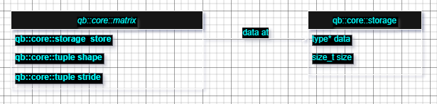

# Notes for `qubix2`
`qubix2` is a lightweight linear algebra library with different modules for 
different purposes. For example, the `core` module is for general purpose 
linear algebra operations, the `gemoetry` module will be for computer 
graphics applications where we are interested in the gemoetric aspect of 
linear algebra and `fft` module is for, you guessed it, Fourier transforms. 
More modules will come into play later. 

The goal of this note is to explain the underlying concepts and structure of 
the library.

## Structure
Any module of this library will have a central data structure meant to store
essential information that we manipulate and operate on. For example, the 
`core` module has a `Matrix` class central to all operations in the module. 
It consists of a storage unit (which is the `storage` class) to store matrix 
elements as arrays (heap arrays). 

So, the picture is something like this:

This is going to be the basic concept behind any info containing data structure 
in the house.  
In general, the `qb::core::storage` structure contained inside the matrix will 
be inaccessible to the user, and only through matrix operations can they be 
manipulated or accessed in general.

# Module Sections

[Core Module](https://github.com/kartechkeyan98/Qubix2/blob/main/notes/core.md)

 
